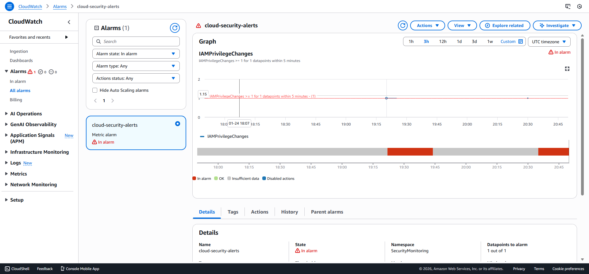
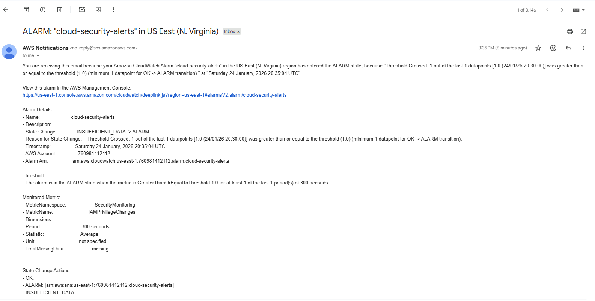

# AWS Serverless Task Manager API

A fully serverless REST API built on AWS using Lambda, API Gateway, and DynamoDB.

## Architecture

- Amazon API Gateway (REST)
- Amazon DynamoDB
- IAM (role-based access)
- CloudWatch (logging)

## Security
- Implemented least-privilege IAM policies restricting Lambda access to specific DynamoDB actions and resources
- Removed managed full-access policies to reduce attack surface
- Validated permissions through functional API testing

## Endpoints

## Security Monitoring Validation
## Cloud Security Monitoring

- Enabled AWS CloudTrail for account-wide API activity logging across all regions
- Streamed CloudTrail logs into CloudWatch Logs for centralized analysis
- Created CloudWatch metric filters to detect IAM privilege changes
- Configured CloudWatch alarms with SNS email notifications for real-time security alerts
- Validated alerts by simulating IAM privilege escalation events


### CloudWatch Alarm Triggered


### SNS Email Alert


## IAM Misconfiguration Scanner

- Built a Python-based AWS Lambda tool to analyze IAM roles and policies
- Identified overly permissive permissions such as wildcard actions and resources
- Generated structured security findings to highlight privilege escalation risks


### POST /tasks
Creates a new task.
```json
{
  "title": "Example task"
}
